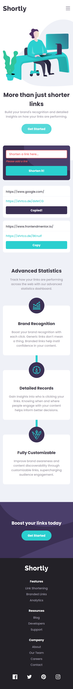
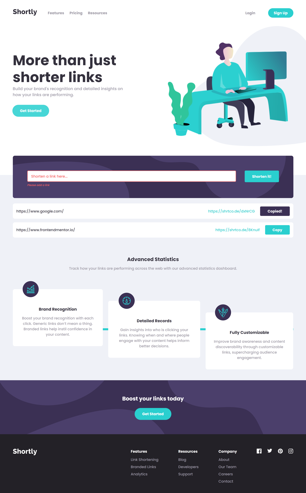

# Frontend Mentor - Shortly URL shortening API Challenge solution

Hello!

Firstly, thank you for taking your time to review my project. Kindly note, that this is a solution to the [Shortly URL shortening API Challenge challenge on Frontend Mentor](https://www.frontendmentor.io/challenges/url-shortening-api-landing-page-2ce3ob-G).

## Table of contents

- [Overview](#overview)
  - [The challenge](#the-challenge)
  - [Screenshot](#screenshot)
  - [Built with](#built-with)

## Overview

The project was build with React.js, TypeScript and SCSS for overall styling. For on scroll animations, I used Framer Motion library. The source directory of this application is divided into folders listed below:

- Assets folder - contains all of the images and icons used within the project as well as SCSS files with color variables and simple animations.
- Components folder - contains all components of the project. This folder itself is divided into Layout (main UI components), subcomponents (smaller parts of the UI components) and reusable (small components often used throughout the entire project) folders.
- Context folder - contains React Context files which are responsible for communicating with API.
- Models folder - contains commonly used interfaces and classes.

### The challenge

I have made sure that users are able to:

- View an optimal layout for the site depending on their device's screen size.
- Shorten any valid URL.
- Receive an error message when the form is submitted if:
  - The input field is empty - users will receive `Please add a link` message along with error-ish styling for the input.
  - Provided URL is invalid - the check is performed using a regular expression, users will receive `Invalid link` message.
- See a list of their shortened links, even after refreshing the browser:
  - Cards with new shortened links are dynamically rendered, starting from the most recent one.
  - The array with shortened links is stored inside local storage and as soon as the application is mounted, useEffect hook checks if there are any results saved.
- Copy the shortened link to their clipboard in a single click.

### Screenshots

Mobile view:

Desktop view:

### Built with

- Semantic HTML
- SCSS
- TypeScript
- React.js
- Framer Motion library
- Mobile-first workflow

